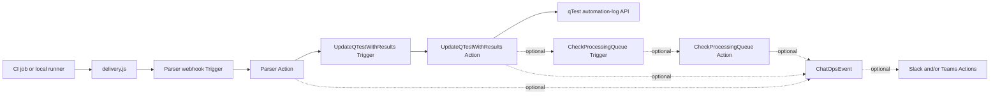

<p align="center">
  
</p>

# qTest Pulse Community Marketplace

[](https://documentation.tricentis.com/qtest/od/en/content/pulse/qtest_pulse_quick_start_guide.htm)
[](https://nodejs.org/)
[](LICENSE.md)

Community-maintained, standalone JavaScript Actions and supporting scripts for
qTest Pulse. The repository covers automation-result delivery and parsing,
qTest result submission, CI pipeline dispatch, ChatOps notifications, and
selected qTest integrations.

These are open-source examples, not a substitute for supported product
integrations. Review the [software disclaimer](DISCLAIMER.md), test in a
non-production Pulse project, and adapt permissions and field mappings to your
environment.

## Start Here

| Goal | Documentation |
| --- | --- |
| Upgrade an existing v2 installation | [Migrating to v3](docs/MIGRATING_TO_V3.md) |
| Review release changes | [Changelog](CHANGELOG.md) |
| Submit automated test results to qTest | [Results quick start](#results-pipeline-quick-start) |
| Choose and configure a parser | [Parser catalog](parsers/README.md) |
| Configure the dependency-free delivery script | [Delivery guide](delivery/README.md) |
| Configure qTest submission and queue monitoring | [qTest results guide](qtest/README.md) |
| Trigger a CI pipeline | [CI provider guide](citools/README.md) |
| Send neutral notifications to Slack and Teams | [ChatOps guide](chatops/README.md) |
| Understand every repository item | [Repository catalog](docs/REPOSITORY_CATALOG.md) |
| Reconcile an ambiguous downstream 5xx | [Invocation reconciliation](docs/PULSE_INVOCATION_RECONCILIATION.md) |

The official [qTest Pulse Quick Start
Guide](https://documentation.tricentis.com/qtest/od/en/content/pulse/qtest_pulse_quick_start_guide.htm)
explains Pulse access and the product UI. The [qTest API documentation](https://qtest.dev.tricentis.com/)
is the canonical API reference.

## What Is Pulse, and What Does It Do?

qTest Pulse is an event-driven integration runner hosted alongside qTest. It
receives an event, runs JavaScript in response, and can call an external API or
emit another Pulse event. In practical terms, it is the glue between systems:

- a source-control webhook can ask Pulse to start a CI pipeline;
- a CI job can send a result file to a Pulse parser;
- a parser can translate that tool-specific document into qTest automation
  logs;
- a qTest Action can submit those logs and monitor their processing queue; and
- any stage can emit one neutral notification event for Slack and Teams.

Pulse does not automatically understand a JUnit, UFT, Cypress, or other result
file. An Action in this repository supplies that translation. Pulse also does
not run tests by itself unless an Action calls a CI provider that runs them, and
it is not the same ingestion path as qTest Launch/Universal Agent.

A useful mental model is:

```text
something happened
        |
        v
Trigger receives an event
        |
        v
Rule selects one or more Actions
        |
        v
Action validates, transforms, calls an API, or emits another Trigger
```

Each Action execution has its own Pulse execution record, payload, standard
output, standard error, and response. When one Action emits another Trigger,
Pulse creates a child execution. That is why this repository propagates a
`correlationId`: one business operation may cross several independent Pulse
executions before qTest finishes processing it.

Pulse objects are scoped to the selected qTest project. Copying an Action's
source alone is therefore not enough; the project must also contain the
Constants and exact downstream Trigger names that source expects, plus Rules
that connect each Trigger to the intended Action or Actions.

## Pulse Concepts Used Here

Pulse workflows are assembled from four project-scoped objects:

- A **Trigger** is an inbound webhook or an event that another Action can emit.
- An **Action** is one standalone JavaScript program.
- A **Rule** connects one Trigger to one or more Actions.
- A **Constant** supplies project-specific configuration to Actions.

Trigger names referenced by source code are contracts and must match exactly.
Action and Rule display names are descriptive and may be chosen locally.

The maintained results path is:



`SonarQubeJSON.js` is the one parser exception: SonarQube posts its webhook JSON
directly to that parser's Trigger, so `delivery.js` is not involved.

## Results Pipeline Quick Start

### 1. Confirm prerequisites

You need:

- access to the qTest Pulse project and permission to create Constants,
  Triggers, Actions, and Rules;
- a qTest bearer token with access to the destination project;
- a qTest Test Cycle or Test Suite that will receive the results;
- a result format supported by one of the [maintained parsers](parsers/README.md);
  and
- Node.js 22 or 24 LTS where `delivery.js` will run. Use a currently supported
  LTS release as listed by [Node.js](https://nodejs.org/en/about/previous-releases).

Use a dedicated service account and grant only the qTest projects and actions
the automation requires.

### 2. Create the qTest Constants

Create these Pulse Constants in the destination Pulse project:

| Constant | Value |
| --- | --- |
| `ManagerURL` | qTest Manager hostname only, for example `example.qtestnet.com` |
| `QTEST_TOKEN` | qTest bearer token value without the word `Bearer` |

`ManagerURL` must not contain `http://`, `https://`, a path, query, fragment, or
trailing slash. The qTest Actions always construct an HTTPS URL.

Queue timeout and polling Constants are optional and documented in the
[qTest results guide](qtest/README.md).

### 3. Create the qTest submission objects

Create these objects with the exact Trigger names shown:

| Object | Name/source | Required |
| --- | --- | --- |
| Trigger | `UpdateQTestWithResults` | Yes |
| Action | Copy `qtest/UpdateQTestWithResults.js` | Yes |
| Rule | Connect the Trigger above to the Action above | Yes |
| Trigger | `CheckProcessingQueue` | Recommended |
| Action | Copy `qtest/CheckProcessingQueue.js` | Recommended |
| Rule | Connect the queue Trigger to the queue Action | Recommended |

Queue monitoring deliberately performs one check per Pulse execution. When the
qTest queue is still processing, the Action emits one bounded follow-up
`CheckProcessingQueue` event.

### 4. Create one parser Rule

1. Choose the parser matching the actual result-file format.
2. Create an Action and copy the complete parser source into it.
3. Create an inbound Trigger for that parser. Its name is your choice because
   external delivery uses its webhook URL.
4. Create a Rule connecting the parser Trigger to the parser Action.
5. Confirm that the same Pulse project contains the exact
   `UpdateQTestWithResults` Trigger created in the previous step.

Every maintained parser source calls only the unified
`UpdateQTestWithResults` Trigger. Endpoint selection does not belong in a
parser.

### 5. Configure delivery

Copy `delivery/node.js/delivery.js` into the CI workspace and edit only its
configuration block:

- `pulseUri`: webhook URL generated for the parser Trigger;
- `projectId`: qTest project id;
- `targetType`: `test-cycle` or `test-suite`;
- `targetId`: destination id/PID accepted by the corresponding qTest API;
- `resultsPath`: generated result-file path;
- `resultFormat`: normally `auto`; and
- `command`: optional test command to run before delivery.

The script has no npm dependencies. It sends JSON as native JSON and encodes
XML/TRX from the original file bytes as Base64 so the XML cannot interfere with
the outer JSON serialization.

See the [delivery guide](delivery/README.md) for the complete contract and
configuration example.

### 6. Run and verify the complete chain

For the first execution, use a non-production target and confirm all of the
following:

1. `delivery.js` reports that Pulse accepted the parser webhook and prints the
   delivery `correlationId`.
2. The parser execution reports the number of formatted logs and the child
   Pulse execution id created for `UpdateQTestWithResults`.
3. The submission Action reports the qTest queue id and selected destination.
4. Queue monitoring reaches `SUCCESS`, if configured.
5. The expected test runs and statuses appear under the selected qTest object.

Webhook acceptance, a Pulse child execution id, and a qTest queue id represent
different stages. A successful delivery response does not prove that qTest
finished processing the logs. See the [identifier glossary](qtest/README.md#identifier-glossary).

Do not automatically repeat a result submission after a Pulse 502, 503, or 504
from a downstream invocation. The child Action might have started before the
gateway response failed. Follow the [reconciliation procedure](docs/PULSE_INVOCATION_RECONCILIATION.md)
first.

## Delivery Contract

Delivery contract version 2 carries canonical destination fields:

```json
{
  "deliverySchemaVersion": 2,
  "correlationId": "generated-uuid",
  "projectId": "123",
  "targetType": "test-suite",
  "targetId": "TS-456",
  "testsuite": "TS-456",
  "resultFormat": "json",
  "resultEncoding": "identity",
  "result": {}
}
```

The delivery script adds exactly one compatibility destination field:

- `test-cycle` adds `testcycle`;
- `test-suite` adds `testsuite`.

Do not supply both. JSON results use `resultEncoding: "identity"`; XML and TRX
use `resultEncoding: "base64"`. Base64 is an encoding mechanism, not encryption
or an integrity control.

The four delivery-fed JSON parsers also accept the old unversioned Base64 JSON
envelope during the compatibility period. XML/TRX remains Base64-compatible.

## Other Integration Paths

### CI pipeline triggers

The `citools` directory contains standalone Actions for Bamboo, Jenkins,
TeamCity, GitHub Actions, GitLab CI/CD, Azure Pipelines, CircleCI, Bitbucket
Pipelines, and Buildkite. Provider Actions accept correlated event payloads and
can emit the same optional `ChatOpsEvent` contract. Follow the
[CI provider guide](citools/README.md); do not infer credentials or parameter
names from another provider.

### Slack and Microsoft Teams

Slack Workflow Builder and Microsoft Teams Workflows consume the same neutral
payload:

```json
{
  "correlationId": "optional-cross-rule-id",
  "message": "Human-readable notification"
}
```

Connect both provider Actions to `ChatOpsEvent` when intentional fan-out is
desired. The former Slack attachment rule is retired. See the
[ChatOps setup guide](chatops/README.md).

### Azure DevOps, Jira, and Scenario

The rules under `qtest/azure-devops`, `qtest/jira`, and `qtest/scenario` are
older, specialized integrations. Their source headers and directory READMEs
document their assumptions. They have not yet received all of the validation,
error-handling, logging, and contract modernization applied to the maintained
results, ChatOps, and CI paths. Treat them as reference implementations and
review every mapping before production use.

The maintained `CucumberJSON.js` parser submits through the standard result
pipeline. It does not automatically perform the historical Scenario
requirement-linking flow.

## Compatibility Boundaries

- The maintained parser sources are not drop-in replacements for historical
  Pulse sample Actions with different Trigger and Constant names.
- qTest Pulse and qTest Launch/Universal Agent integrations may submit through
  different paths. Do not submit the same result through both paths.
- Tosca Pulse parsing is separate from native qTest/Tosca and Launch flows.
- SonarQube sends a direct webhook; all other current result parsers receive a
  result file through the delivery contract.
- HTML reports are not accepted as parser input. Generate JSON, XML, or TRX.

## Security and Operations

- Treat Pulse, Slack, Teams, and CI webhook URLs as secrets.
- Never put tokens in event payloads, query strings, source files, or logs.
- Hide sensitive Pulse Constant values and rotate them according to the
  provider's policy.
- Prefer HTTPS for every external integration and reject unexpected hosts.
- Keep correlation ids in logs, but do not treat them as authentication or
  idempotency keys.
- Start with non-production qTest objects and CI pipelines.
- Use the narrowest practical service-account permissions.
- Preserve failed execution logs long enough to reconcile ambiguous calls.

## Repository Status

| Area | Status |
| --- | --- |
| Delivery contract v2 | Maintained and contract tested |
| JSON/XML result parsers | Maintained; representative contract tests plus parser-wide structural checks |
| Unified qTest submission and queue monitor | Maintained and contract tested |
| Slack and Teams ChatOps | Maintained and contract tested |
| CI trigger Actions | Maintained and contract tested; provider smoke tests require local credentials |
| Azure DevOps qTest synchronization | Legacy; modernization planned last |
| Jira and Scenario helpers | Legacy/reference |

See the [repository catalog](docs/REPOSITORY_CATALOG.md) for the complete
inventory.

## Development and Contribution

Use a supported Node.js LTS release, then run:

```shell
npm ci
npm run validate
```

The package manifest is a repository-only validation harness. It does not make
`delivery.js` install packages at runtime.

Every deployable rule must:

- remain a standalone JavaScript file suitable for copying into one Pulse
  Action;
- begin with a usage comment describing its input, Constants, Trigger
  dependencies, output, and important limitations;
- validate required configuration before external requests;
- avoid logging credentials, signed URLs, or complete result documents;
- await required asynchronous work so Pulse execution status is meaningful;
- avoid automatic retries for ambiguous non-idempotent operations; and
- include focused tests or fixtures when its contract changes.

Read [CONTRIBUTING.md](CONTRIBUTING.md) before opening a change. Contributions
are licensed under the [MIT License](LICENSE.md) and governed by the
[Code of Conduct](CODE_OF_CONDUCT.md).
